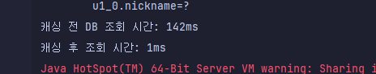

# SPRING PLUS

---

## Level 1.1: 코드 개선 퀴즈 - @Transactional의 이해

### 에러 원인
`TodoService` 클래스에 `@Transactional(readOnly = true)`가 설정되어 있어, **일정 생성 시 데이터베이스가 읽기 전용 모드로 연결**되었습니다. 이로 인해 데이터 수정 작업(`INSERT`)이 차단되면서 에러가 발생했습니다.

### 해결 방법
`saveTodo` 메서드에 `@Transactional`을 추가하여, **해당 메서드만 읽기-쓰기 모드로 설정**했습니다.

---

## Level 1.2: 코드 추가 퀴즈 - JWT의 이해

### 해결 방법
1. **User 엔티티에 `nickname` 필드 추가**: `User` 엔티티에 `nickname` 필드를 추가하여 닉네임 정보를 저장할 수 있도록 수정했습니다.
2. **DTO 및 생성자에 `nickname` 필드 추가**: 회원가입, 로그인, 일정 생성 등의 DTO와 생성자에 `nickname` 필드를 추가하여 닉네임 정보를 포함했습니다.
3. **JWT 필터 수정**: `JwtFilter`에서 `httpRequest.setAttribute("nickname", claims.get("nickname"))`를 추가하여, JWT에서 추출한 `nickname` 값이 요청 속성으로 전달되도록 설정했습니다.

---

## Level 1.3: 코드 개선 퀴즈 - AOP의 이해

### 해결 방법
1. **`@Before` 어노테이션 사용**: AOP가 `changeUserRole()` 메서드 실행 **전**에 동작하도록 `@After`를 `@Before`로 변경했습니다.
2. **포인트컷 수정**: 포인트컷을 `"execution(* org.example.expert.domain.user.controller.UserAdminController.changeUserRole(..))"`로 지정하여, **`UserAdminController`의 `changeUserRole()` 메서드**에 AOP가 적용되도록 수정했습니다.

맞습니다, 혼동을 드려서 죄송합니다! 예외 처리기를 수정하지 않고 **테스트 코드만 수정**해서 해결한 경우라면 아래와 같이 간단하게 작성할 수 있습니다.

---

## Level 1.4: 테스트 코드 퀴즈 - 컨트롤러 테스트의 이해

### 해결 방법
- **테스트 코드 수정**: 기존에는 200 상태 코드를 예상했지만, 실제로는 `InvalidRequestException`이 발생할 때 400 에러가 반환됩니다. 따라서, 테스트 코드에서 **예상 상태 코드를 400으로 변경**하여 일관성을 맞췄습니다.

---

## Level 1.5: 코드 개선 퀴즈 - JPA의 이해

### 요구사항
1. **할 일 목록 조회 시 `weather` 조건**으로 검색할 수 있도록 구현했습니다. `weather` 조건은 선택적입니다.
2. **수정일(`modifiedAt`) 기준으로 기간 조회**가 가능하도록 구현했습니다. `start`와 `end` 기간 조건도 선택적입니다.
3. 여러 검색 조건을 조합할 수 있도록 JPQL을 사용해 다양한 쿼리 메서드를 작성했습니다.

### 구현 내용

#### `TodoRepository`에 JPQL 쿼리 작성
`weather`와 `modifiedAt` 필드의 조건을 처리하기 위해 다양한 JPQL 쿼리를 작성했습니다.

- `weather` 조건만 있을 때
- `modifiedAt` 기간 조건만 있을 때
- `weather`와 `modifiedAt` 조건이 모두 있을 때
- 기본 조회 (조건이 없을 때)

### 테스트
```
localhost:8080/todos?page=1&size=10&weather=Blustery Winds&start=2024-11-14T00:00:00&end=2024-11-14T23:59:59
```
---

## Level 2.6 : JPA Cascade

### 요구사항
- 할 일을 새로 저장할 때, 할 일을 생성한 유저가 자동으로 담당자로 등록되어야 합니다.
- JPA의 `cascade` 기능을 사용하여, `Todo` 생성 시 해당 유저가 `Manager`로 자동 등록되도록 구현했습니다.

### 구현 내용

**`CascadeType.PERSIST` 설정**:
    - `Todo`와 `Manager` 사이의 `@OneToMany` 관계에서 `cascade = CascadeType.PERSIST`를 설정하여, `Todo`가 저장될 때 연관된 `Manager` 엔티티도 자동으로 저장되도록 했습니다.

--- 

## Level 2.7 : N+1

### 문제 원인
`CommentController` 클래스의 `getComments()` API에서 **N+1 문제**가 발생하여, 각 댓글의 작성자(`User`) 정보를 조회하기 위해 추가적인 쿼리가 반복적으로 실행되고 있었습니다.

### 해결 방법
`CommentRepository`의 JPQL 쿼리에 **`JOIN FETCH`를 추가**하여, `Comment`와 연관된 `User` 데이터를 한 번의 쿼리로 가져오도록 수정했습니다.

---

## Level 2.8: QueryDSL을 활용한 JPQL 대체

### 요구사항
- 기존 JPQL 쿼리를 QueryDSL로 변경하여 `findByIdWithUser` 메서드를 구현합니다.
- N+1 문제가 발생하지 않도록 `fetchJoin`을 사용해 데이터를 한 번에 조회합니다.

### 구현 내용
1. **JPAQueryFactory 빈 설정**: QueryDSL을 사용하기 위해 `JPAConfiguration` 클래스에 `JPAQueryFactory`를 빈으로 등록했습니다. 이를 통해 QueryDSL을 사용하여 동적 쿼리를 작성할 수 있게 설정했습니다.

2. **QueryDSL로 단건 조회 쿼리 구현**: 
   - `QTodo`와 `QUser`로 생성된 QueryDSL Q 클래스를 사용하여 `Todo`와 `User` 엔티티에 접근했습니다.
   - **단건 조회**를 위해 `fetchOne()`을 사용하여 `todoId`에 해당하는 단일 `Todo`를 조회하고, N+1 문제가 발생하지 않도록 **fetchJoin**을 통해 연관된 `User` 데이터를 한 번에 가져왔습니다.
---

## Level 2.9: Spring Security와 JWT 통합

### 요구사항
- Spring Security를 도입하여 기존의 `Filter`와 `Argument Resolver`로 구현된 인증 및 인가 로직을 대체
- JWT를 사용한 토큰 기반 인증 방식 유지
- 권한 및 접근 제어는 Spring Security의 기능 활용


## 구현 내용

### 1. **JWT를 쿠키 기반으로 관리**
- 헤더에서 JWT를 관리하던 기존 방식의 불편함(테스트 시 매번 헤더에 토큰 추가)을 해결하기 위해, 쿠키를 통해 JWT를 관리하도록 변경.
- JWT 생성 및 검증 로직은 `JwtUtil`에서 관리.

#### 주요 수정 사항:
1. **JWT 생성 및 쿠키 저장**
   ```java
   public void addJwtToCookie(String token, HttpServletResponse res) {
       try {
           token = URLEncoder.encode(token, "utf-8").replaceAll("\\+", "%20");
           Cookie cookie = new Cookie("Authorization", token);
           cookie.setPath("/");
           res.addCookie(cookie);
       } catch (UnsupportedEncodingException e) {
           log.error(e.getMessage());
       }
   }
   ```

2. **JWT 검증 및 쿠키에서 가져오기**
   ```java
   public String getTokenFromRequest(HttpServletRequest req) {
       Cookie[] cookies = req.getCookies();
       if (cookies != null) {
           for (Cookie cookie : cookies) {
               if (cookie.getName().equals("Authorization")) {
                   return cookie.getValue();
               }
           }
       }
       return null;
   }
   ```

### 2. **JWT 인증 및 인가 필터 구현**

### `JwtAuthenticationFilter`
- **로그인 요청을 처리**하며, 사용자 인증 및 JWT 생성을 담당합니다.
- Spring Security의 `UsernamePasswordAuthenticationFilter`를 상속받아 구현.

#### `JwtAuthorizationFilter`
- `OncePerRequestFilter`를 상속받아 모든 요청마다 JWT를 검증.
- 쿠키에서 JWT를 추출하고 유효성을 검증한 뒤, Spring Security의 `SecurityContext`에 인증 정보를 저장.

```java
@Override
protected void doFilterInternal(HttpServletRequest req, HttpServletResponse res, FilterChain filterChain)
        throws ServletException, IOException {
    String tokenValue = jwtUtil.getTokenFromRequest(req);

    if (!StringUtils.isEmpty(tokenValue)) {
        tokenValue = tokenValue.substring(7); // "Bearer " 제거
    }

    if (StringUtils.hasText(tokenValue) && jwtUtil.validateToken(tokenValue)) {
        Claims info = jwtUtil.extractClaims(tokenValue);
        setAuthentication(info.getSubject());
    }

    filterChain.doFilter(req, res);
}
```

### 3. **Spring Security 설정**

#### `WebSecurityConfig`
- Spring Security를 활용한 경로별 접근 제어 및 JWT 필터 등록.
- `SecurityFilterChain`을 사용해 Spring Security의 HTTP 설정을 구성.

```java
@Bean
public SecurityFilterChain securityFilterChain(HttpSecurity http) throws Exception {
    http.csrf(csrf -> csrf.disable())
        .sessionManagement(sessionManagement -> sessionManagement.sessionCreationPolicy(SessionCreationPolicy.STATELESS))
        .authorizeHttpRequests(authorizeRequests -> authorizeRequests
            .requestMatchers("/auth/**").permitAll() // 로그인 및 회원가입 경로 허용
            .anyRequest().authenticated())          // 그 외 경로는 인증 필요
        .addFilterBefore(jwtAuthorizationFilter(), UsernamePasswordAuthenticationFilter.class);

    return http.build();
}
```

---

### 4. **테스트 및 검증**

- **JWT 생성 및 저장 확인**
    1. 로그인 후, 응답 쿠키에 JWT가 저장됨을 확인.
    2. 이후 모든 요청에 자동으로 쿠키에 저장된 JWT가 전송되어 인증 필터를 통과.

- **Postman 테스트**
    1. 로그인:
        ```json
        {
            "email": "test@example.com",
            "password": "1234"
        }
        ```
    
    2. 일정 생성:
        - JWT가 쿠키에 저장된 상태에서 일정 생성 API 호출 시, 인증이 성공적으로 이루어짐.

### 5. **장점**
- **테스트 편의성**: JWT를 쿠키로 관리하여 헤더에 매번 토큰을 추가할 필요가 없음.
- **Spring Security 활용**: 기존 인증 로직과 권한 관리 로직을 Spring Security와 연동.
- **코드 간소화**: 인증 관련 컨트롤러 및 서비스 로직을 Spring Security 필터로 대체.

### 6. **향후 개선점**
- 쿠키에 `HttpOnly`, `Secure` 옵션 추가로 보안 강화.
- Refresh Token 도입을 통해 토큰 만료 시 자동 재발급 구현.

### 7. **트러블 슈팅** 헤더와 쿠키 방식의 jwt 검증의 차이
https://velog.io/@happy_code/%ED%97%A4%EB%8D%94%EC%99%80-%EC%BF%A0%ED%82%A4%EC%9D%98-JWT-%EA%B2%80%EC%A6%9D-%EB%B0%A9%EC%8B%9D-%EC%B0%A8%EC%9D%B4

아래는 주어진 템플릿에 맞춘 README 내용입니다:

---

### **Level 3.10 QueryDSL을 사용하여 검색 기능 만들기**

#### **요구사항**
- 일정 데이터를 검색하는 API를 구현한다.
- QueryDSL을 사용하여 검색 조건에 따라 데이터를 조회한다.
- 페이징 처리와 Projections를 활용하여 필요한 데이터만 반환한다.
- 검색 조건:
    1. 제목 키워드: 제목에 특정 키워드가 포함된 일정 검색 (부분 일치).
    2. 생성일 범위: 특정 날짜 범위 안에 생성된 일정 검색.
    3. 담당자 닉네임: 담당자 닉네임이 특정 키워드를 포함하는 일정 검색 (부분 일치).
- 검색 결과:
    - 검색된 일정 제목만 반환.
    - 일정에 할당된 담당자 수.
    - 해당 일정에 작성된 댓글 수.

#### **구현 내용**
1. **클래스 작성**
    - **`TodoSearchRequest.java`**: 검색 조건을 담는 DTO 클래스.
    - **`TodoSearchResponse.java`**: 검색 결과를 담는 DTO 클래스.

2. **API 구현**
    - **`TodoController.java`**: `/api/todos/search` 경로로 검색 요청을 처리하는 API 구현 (`searchTodo` 메서드).

3. **서비스 구현**
    - **`TodoService.java`**: 검색 조건을 받아 Repository로 전달하고 결과를 반환하는 `searchTodo` 서비스 메서드 구현.

4. **Repository 구현**
    - **`TodoRepositoryCustom.java`**: 커스텀 Repository 인터페이스 작성.
    - **`TodoRepositoryCustomImpl.java`**: QueryDSL을 사용하여 `findByKeywordAndCreatedAtBetweenAndNickname` 메서드 구현. 해당 메서드는 검색 조건에 따라 데이터를 조회하고 페이징 처리된 결과를 반환한다.

### **level 3.11 Transaction 심화**

#### **요구사항**
- 매니저 등록 요청 시 로그를 기록하는 기능을 구현한다.
- `@Transactional`의 옵션을 사용하여 매니저 등록과 로그 기록이 각각 **독립적인 트랜잭션**으로 처리되도록 한다.
    - 매니저 등록이 실패해도 로그는 반드시 저장되어야 한다.
- 로그 테이블(`log`)을 생성하고 아래 조건에 따라 데이터를 저장한다.
    1. 로그 생성 시간은 자동으로 기록된다.
    2. 매니저 등록 요청 내용(`logDetails`)과 상태(`status`: 성공/실패)를 저장한다.

#### **구현 내용**
1. **클래스 작성**
    - **`Log.java`**: 로그 데이터를 저장하는 엔티티.
        - **JPA Auditing을 사용하여 생성 시간을 Timestamped 상속을 통해 자동 관리
        - 필드: `logDetails`, `status`.
    - **`LogRepository.java`**: 로그 데이터를 저장하기 위한 JPA Repository.

2. **로그 저장 서비스**
    - **`LogService.java`**:
        - 독립적인 트랜잭션에서 로그를 저장하기 위해 `@Transactional(propagation = Propagation.REQUIRES_NEW)`를 사용.

3. **매니저 등록 서비스**
    - **`ManagerService.java`**:
        - 매니저 등록 요청을 처리하는 `saveManager` 메서드에서 로그 저장 로직 추가.
        - 성공 시 "SUCCESS" 상태로 로그를 저장.
        - 실패 시 "FAILURE" 상태로 로그를 저장.

4. **트랜잭션 처리**
    - 매니저 등록 트랜잭션과 로그 저장 트랜잭션을 분리하여 독립적으로 처리.
    - 매니저 등록이 실패하더라도 로그는 항상 저장되도록 구현.

# 대용량 데이터 처리 및 검색 속도 개선

---

## **요구사항**
1. **대용량 데이터 생성**
    - 테스트 코드로 유저 데이터를 만 건 생성.
    - 데이터 생성 시 닉네임은 랜덤으로 지정하며, 중복되지 않도록 처리.

2. **유저 검색 API**
    - 닉네임을 조건으로 유저 목록을 검색하는 API 작성.
    - 닉네임은 **정확히 일치**해야 검색 가능.

3. **검색 속도 개선**
    - 검색 속도를 개선할 수 있는 다양한 방법 적용.
    - 각 방법의 속도 개선 효과를 측정하여 `README.md`에 기록.

---

### **level 3.13 대용량 데이터 처리**

## **구현 내용**

### **1. 대용량 데이터 생성**
- **클래스**:
    - `BulkInsertTest`: 유저 데이터를 대량으로 생성하는 테스트 클래스.

### **2. 유저 검색 API**
- **클래스**:
    - `UserController에 getUserByNickname`: 닉네임 조건으로 유저 목록을 검색하는 API를 제공.
    - `UserService`: 검색 로직 및 캐싱 로직 구현.
    - `UserRepository`: 닉네임 기반 유저 검색 메서드 정의.


### **3. 성능 테스트 결과**

- **테스트 코드**:
    - `CachingTest`: 캐싱 사용 전후의 검색 속도를 비교하는 테스트 클래스.

- **결과 비교**
- 
  | 테스트 환경        | 데이터 수 | 캐싱 사용 여부 | 조회 시간 |
  |--------------------|-----------|----------------|-----------|
  | 로컬 개발 환경     | 10,000건  | 미사용         | 약 142ms   |
  | 로컬 개발 환경     | 10,000건  | 사용           | 약 1ms    |

- **테스트 결과 이미지**



---

### **결론**
- 캐싱 적용 전후로 동일한 데이터 조회 시 약 **99.30%의 속도 개선**을 확인.
- 대규모 데이터 환경에서 캐싱은 효율적인 성능 최적화 도구임.
